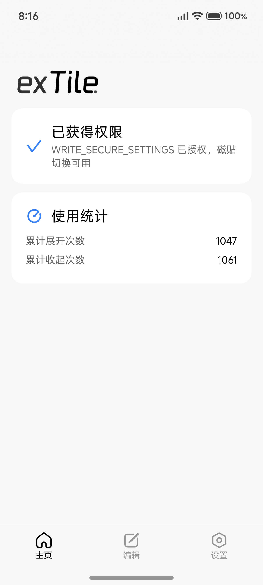
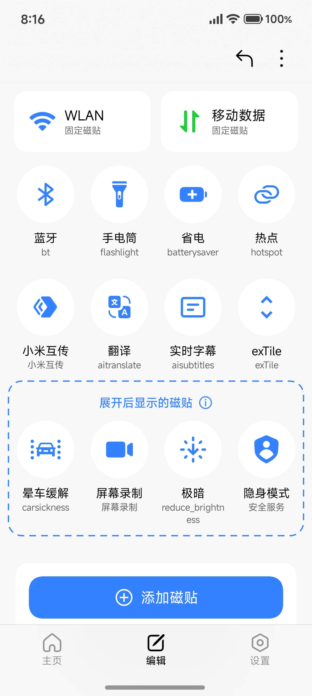
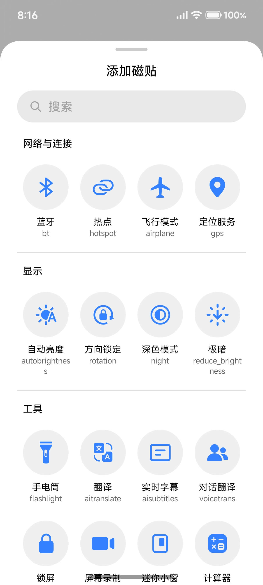
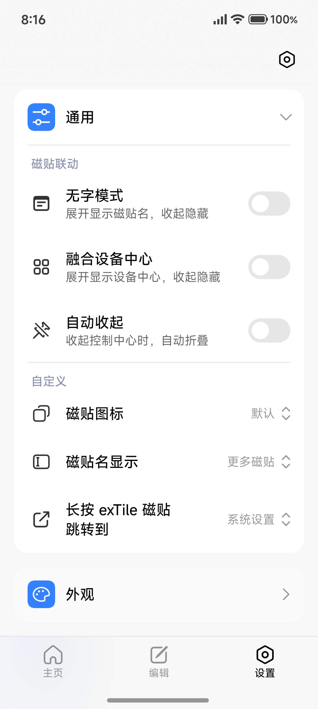
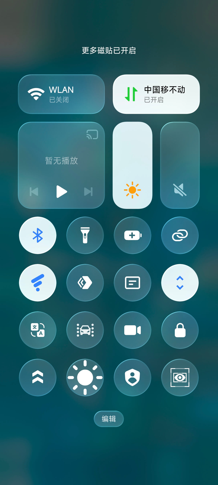

# exTile

> English README WIP

让 Android 控制中心，在简洁和效率直之间找到「平衡」的魔法。

**无需 Root。**


---

exTile 是一个增强 Android 定制 UI 的控制中心的应用，让次常用的磁贴收纳起来，点击 exTile 即可呼出。

基于 **Jetpack Compose + MIUIX** 构建，支持磁贴编辑、布局一键切换。

## 截图预览

<p align="center">
  
  
  
  
  
</p>

## 功能特性

- **QS 磁贴一键切换**：通过 `ExTileService` 在「展开 / 收起」两套布局间一键切换
- **磁贴编辑**：4 列网格拖拽排序，支持添加系统 / 自定义磁贴；**一页式编辑**，exTile 磁贴作为「分界锚点」，其前方磁贴为收起时可见，其后为仅展开时可见
- **配置备份 / 恢复**：JSON 格式导出 / 导入，支持从系统当前配置导入
- **小米设备特化**：自动检测 MIUI / HyperOS，显示固定卡片与编辑磁贴
- **设备感知磁贴**：根据设备能力（小米 / AOSP、SDK 版本、系统属性、硬件特性）自动显示 / 隐藏磁贴
- **长按 exTile 行为自定义**：可跳转 exTile / 系统设置 / 自定义应用
- **使用统计**：记录磁贴布局切换的累计展开 / 收起次数

## 权限说明

应用核心权限为 `WRITE_SECURE_SETTINGS`（写入 `sysui_qs_tiles` 实现布局切换）。Shizuku 仅用于首次 / 失效时通过 `pm grant` 自动授权，一旦应用持有该权限即可完全脱离 Shizuku。未安装 Shizuku 时可通过 adb 手动授权（主页提供命令复制弹窗）。

## 架构

<details>
<summary>点击展开</summary>

```text
                    ┌─────────────────────────────┐
                    │        MainActivity          │
                    │  (Shizuku 权限监听 + 横滑导航) │
                    │  HorizontalPager + NavigationBar │
                    │  NavigationBar 毛玻璃模糊     │
                    └──────┬──────────────────────┘
            ┌──────────────┼──────────────┐
            v              v              v
       HomeScreen    TileConfigScreen  SettingsScreen
             │              │              │
             └──────────────┼──────────────┘
                            │
                 ┌──────────▼──────────┐
                 │   ConfigRepository   │  ← DataStore Preferences
                 └─────────────────────┘
                            │
                 ┌──────────▼──────────┐
                 │ SecureSettingsHelper │  ← 读写 sysui_qs_tiles
                 └──────────┬──────────┘
                            │
                 ┌──────────▼──────────┐
                 │   CommandService     │  ← Shizuku UserService (AIDL)
                 └──────────┬──────────┘
                            │
                 ┌──────────▼──────────┐
                 │   Runtime.exec()     │  ← shell 命令执行
                 └─────────────────────┘

    ┌────────────────────────────────────┐
    │         LicensesActivity           │
    │  (独立 Activity，开源许可页面)       │
    │  点击项目直接跳转浏览器              │
    └────────────────────────────────────┘

    ┌────────────────────────────────────┐
    │        DebugToolsActivity          │
    │  (独立 Activity，调试工具页面)       │
    │  查看状态/调试信息/添加磁贴          │
    └────────────────────────────────────┘
```

</details>

## 目录结构

<details>
<summary>点击展开</summary>

```text
exTile/
├── AGENTS.md                    # AI 助手指令
├── debug.ps1                    # 一键构建→安装→启动脚本
├── CONTEXT.md                   # AI 持久上下文
├── TODO.md                      # 待办事项
├── settings.gradle.kts          # 项目设置（含 JitPack 仓库）
├── build.gradle.kts             # 顶级构建脚本
├── gradle.properties            # Gradle 配置
├── local.properties             # 本地 SDK 路径
├── gradlew / gradlew.bat        # Gradle Wrapper
├── gradle/
│   └── libs.versions.toml       # 版本目录
└── app/
    ├── build.gradle.kts         # 模块构建脚本
    └── src/
        └── main/
            ├── AndroidManifest.xml
            ├── aidl/
            │   └── .../ICommandService.aidl
            ├── java/com/hrsthrt74/qstile/
            │   ├── MainActivity.kt          # 主 Activity，横滑导航 + 模糊
            │   ├── LicensesActivity.kt      # 开源许可 Activity（独立页面）
            │   ├── DebugToolsActivity.kt    # 调试工具 Activity（独立页面）
            │   ├── TileLongClickActivity.kt # 幽灵桥接 Activity（长按磁贴行为分发）
            │   ├── tile/
            │   │   └── ExTileService.kt     # QS Tile Service
            │   ├── data/
            │   │   ├── TileConfig.kt        # 磁贴配置数据模型
            │   │   ├── TileCatalog.kt       # 磁贴目录（TileInfo 静态声明 + 查询）
            │   │   ├── TileRequirement.kt   # 磁贴可用性需求（sealed flag 约束 + prop 门控注册表）
            │   │   ├── DeviceProfile.kt     # 设备能力快照（可用性统一求值）
            │   │   ├── TileCapabilityFlags.kt # 能力 flag 调试开关（内存态，调试工具页模拟）
            │   │   ├── CustomTileUtils.kt   # 第三方磁贴工具（解析/查询/图标）
            │   │   ├── ConfigRepository.kt  # 配置持久化（DataStore）
            │   │   ├── StatsRepository.kt   # 使用统计持久化（DataStore）
            │   │   └── ThemeSettings.kt     # 主题设置
            │   ├── shizuku/
            │   │   ├── ShizukuHelper.kt     # Shizuku 状态/权限辅助
            │   │   ├── SecureSettingsHelper.kt # Secure Settings 读写
            │   │   └── CommandService.kt    # Shizuku UserService (AIDL)
            │   └── ui/
            │       ├── components/
            │       │   ├── AppBottomSheet.kt  # 统一底部 Sheet
            │       │   └── AppDialog.kt       # 统一对话框
            │       ├── theme/
            │       │   ├── Color.kt         # 预定义颜色
            │       │   └── Theme.kt         # 动态主题控制器
            │       ├── navigation/
            │       │   └── MainPagerState.kt # 横滑翻页状态管理
            │       └── screens/
            │           ├── HomeScreen.kt     # 主页
            │           ├── TileConfigScreen.kt # 磁贴编辑页（拖拽网格）
            │           ├── SettingsScreen.kt # 设置页
            │           ├── LicensesScreen.kt # 开源许可页
            │           └── DebugToolsScreen.kt # 调试工具页
            └── res/
                └── drawable/                # 磁贴图标（tile_*.xml）
```

</details>

## 技术栈

<details>
<summary>点击展开</summary>

| 依赖 | 版本 |
|------|------|
| Android Gradle Plugin | 9.3.3 |
| Kotlin Compose Plugin | 2.4.20 |
| Compose BOM | 2026.09.00 |
| Navigation Compose | 2.10.1 |
| NavigationEvent Compose | 1.1.2 |
| Activity Compose | 1.13.0 |
| Lifecycle (Runtime / ViewModel Compose) | 2.11.0 |
| DataStore Preferences | 1.2.1 |
| Core KTX / SplashScreen | 1.19.0 / 1.2.0 |
| Material Icons Extended | 1.7.8 |
| Shizuku API / Provider | 13.1.5 |
| MIUIX UI / Icons / Preference / Blur | 0.9.4 |
| Calvin-LL/Reorderable | 3.1.0 |
| DeviceCompat | 2.6 |
| Microsoft Clarity Compose | 3.+ |
| Markwon | 4.6.2 |
| AboutLibraries | 15.2.0 |

- 语言：Kotlin 2.4.20
- 包名：`com.hrsthrt74.qstile`

</details>

## 开源许可

本项目基于 [GNU General Public License v3.0（GPL-3.0）](LICENSE) 开源。

第三方库许可证见应用内「开源许可」页面（`LicensesActivity`）。
